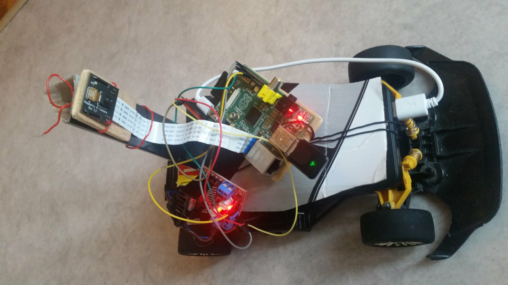
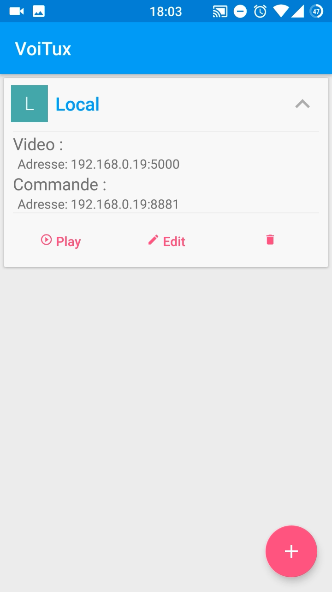
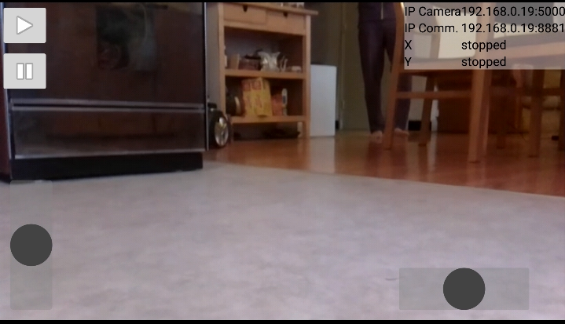

VoiTux V2.0
===================
**Bouh !** 
Bienvenue sur mon projet de voiture télécommandée avec un Raspberry Pi.
Je réalise ce projet pour le fun et le divertissement.
Je vais mettre ici mes sources ainsi que mes notes personnelles. C'est pourquoi je m'excuse d'avance pour les fautes d'orthographe et phrases incompréhensibles. 

> Il est nécessaire d'avoir des bonnes connaissances et d’être débrouillarde pour réutiliser et adapter mes sources. En effet je n'explique pas comment installer Rasbian sur le Raspberry ni comment configurer la connexion wifi. **Si le projet vous intéresse, ne pas hésiter à m'en faire pars.** Nous pourrons ainsi l’améliorer et le rendre accessible à des personnes moins initiées. 

## Objectif
L'objectif est de réaliser une voiture télécommandée par une application Android. La voiture est équipée d'une caméra qui permet à l'utilisateur de suivre la voiture en temps réel.

> **Note :** Le projet est fini et les tests sont concluants. Le Streaming vidéo n'a presque pas de lag (low latency) ~100ms ce qui rend le pilotage agréable. A voir dans la vidéo de démonstration. 

Démonstration : 
[VoiTux_Demo_1.mp4](Doc/VoiTux_Demo_1.mp4)

La voiture :  

  

L'application Android :  

## Matériel

- Une Voiture (j'ai commencé sans la voiture, c'est mieux avec ^^)
- Un Raspberry Pi (Ici j'utilise un modèle B rev2)
- Un dongle wifi
- Une camera (J'utilise le module Raspberry Pi)
- Pont-H L298N (Il permet de contrôler le moteur DC de la voiture)
- Un servomoteur de modélisme (avec 3 fils et pilotable par PWM).
- Alimentation pour le Raspberry
- Un smartphone Android (SQK 15+)

> J'ai effectué mes dev sous linux (Ubuntu 14.04). Si vous êtes sur Win il y aura surement quelques adaptations. 

Rien ne vaut un petit schéma d’ensemble :  

  

## Fonctionnement (Résumé)
La voiture et Android doivent communiquer par un réseau "TCP/IP". en gros par wifi. (Oui, si on ouvre les ports on peut la contrôler de partout sur terre :-] ).  
Sur la voiture on retrouve le "serveur embarqué" qui après son lancement attend un unique client "L'app Android VoiTux". 
VoiTux se connecte à la voiture qui lui transmet le flux vidéo et lui permet de commander la direction et la vitesse. 

### Communication  Android <> Voiture
Deux choses vont communiquer  

1. *Les commandes : direction et vitesse*  
L'utilisateur utilise 2 Joysticks (en X et en Y) sur l’écran tactile ce qui permet d'avoir la direction et la vitesse.
Les informations des Joysticks sont envoyées via Socket au serveur (la voiture).

2. *La video*  
Lors de la connexion du client (Android) le serveur active la vidéo. Il permet ainsi à Android d'afficher le flux vidéo en temps réel.
Pour le Streaming vidéo j'utilise le framework multimédia GStramer

### Le serveur embarqué sur la voiture
Pour réaliser le serveur j'ai utilisé le Python car il est fun a utiliser ( pas de compilateur, simple,...)

Installation et fonctionnement : 
**[Serveur VoiTux](https://github.com/ThibaudAV/VoiTux/tree/master/Raspberry_Pi)**

### L'application Android : VoiTux
Développé avec Android Studio et un Galaxy S5. 

Installation et fonctionnement : 
**[Android VoiTux](https://github.com/ThibaudAV/VoiTux/tree/master/Android)**

### L'application desktop Python GTK
Application très simple permettant de contrôler la voiture via un pc. Utilisé pour remplacer l'application Android pendant les dev ou pour faire des réglages.
Elle a aussi permis d'effectuer des test vidéo afin de trouver le meilleur compromis

**[Python GTK Dev](https://github.com/ThibaudAV/VoiTux/tree/master/PC_Ubuntu)**

##Contact

Ne pas hésiter à me contacter si vous voulez de l'aide
Thibaud AV - thibaud.avenier[at]gmail.com

## License

The content of this project itself is licensed under the [Creative Commons Attribution 3.0 license](http://creativecommons.org/licenses/by/3.0/us/deed.en_US), and the underlying source code used to format and display that content is licensed under the [MIT license](http://opensource.org/licenses/mit-license.php).

